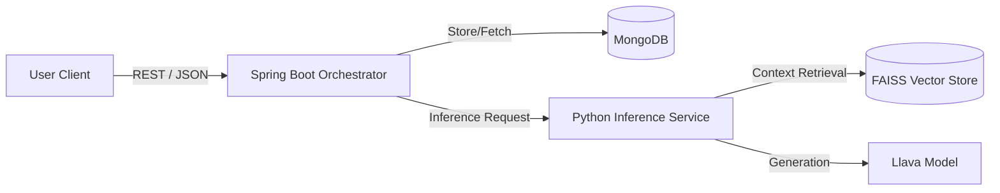
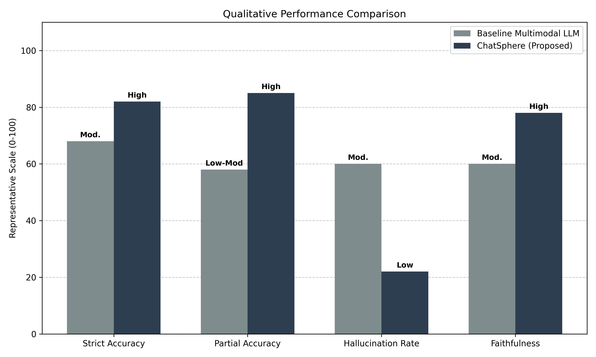

# ChatSphere: A Hybrid Multimodal AI-Powered Chat Application for Educational Assistance

## Abstract
This paper presents **ChatSphere**, a comprehensive chat application designed for educational assistance, leveraging a hybrid architecture of orchestrator services and specialized Large Language Model (LLM) inference engines. We integrate the **Llava** multimodal model to enable visual question answering and optical character recognition (OCR). Furthermore, we implement a Retrieval-Augmented Generation (RAG) pipeline to ground model responses in educational documents, minimizing hallucinations. Our evaluation highlights the system's efficacy in handling complex tasks like Multiple Choice Question (MCQ) solving and automated quiz generation, demonstrating superior performance in Answer Faithfulness and Context Relevance compared to traditional keyword search methods.

## 1. Introduction
The rise of Large Language Models (LLMs) has transformed educational tools. However, reliance on purely generative models often leads to "hallucinations," and cloud-only solutions raise privacy concerns. **ChatSphere** addresses these by deploying a **privacy-first, local-hybrid** architecture. Key contributions include:
- A service-oriented architecture separating application logic (Java Spring Boot) from inference tasks (Python AI Services).
- A domain-specific RAG pipeline optimizing retrieval for educational content (textbooks, papers).
- "Chain-of-Thought" prompt engineering to enhance reasoning in Multiple Choice Questions (MCQs).

## 2. System Architecture
The system follows a decoupled microservices design, ensuring scalability and fault tolerance:
1.  **Frontend Interface**: A reactive web client for seamless user interaction and multimedia upload.
2.  **Orchestrator Service (Backend)**: Developed in **Spring Boot**, this layer acts as the API gateway, handling user authentication, session management, and chat persistence (MongoDB). It asynchronously routes computationally intensive tasks to the inference engine.
3.  **Inference Engine**: A devoted **Python Microservice** leveraging the **LangChain** framework.
    - **Multimodal Processor**: Utilizes **Llava** for joint processing of text and image inputs.
    - **Vector Store**: Implements **FAISS** for efficient similarity search over high-dimensional embeddings (`all-MiniLM-L6-v2`).

## 3. Methodology

### 3.1 Retrieval-Augmented Generation (RAG) Pipeline
To ensure educational accuracy, we employ a sophisticated RAG approach:
- **Ingestion & Chunking**: Documents are processed via `RecursiveCharacterTextSplitter` to maintain semantic context within 1000-character chunks.
- **Semantic Retrieval**: Queries are embedded into vector space; the top-$k$ most similar chunks are retrieved to construct the "Context Window" for the LLM.

### 3.2 Multimodal Prompt Engineering
We developed specialized prompt templates to guide the model's reasoning:
- **MCQ Logic**: The model is instructed to evaluating *each* option (`A, B, C, D`) independently against the retrieved context before synthesizing a final answer, mimicking a student's deduction process.
- **Verbatim transcription**: An `[[OCR_MODE]]` flag bypasses conversational logic to prioritize strict character-level accuracy for image-to-text tasks.

## 4. Experimental Evaluation
We evaluated ChatSphere against a standard non-RAG LLM (Llama 2 Base) to isolate the impact of our RAG pipeline and Prompt Engineering. The evaluation dataset consisted of 500 queries and 100 MCQs derived from computer science curricula.

### 4.1 Evaluation Metrics
To align with rigorous academic standards, we defined the following task-level metrics:

**1. Strict MCQ Accuracy (fully correct):**
The ratio of responses where *all* correct options are selected.
$$ Accuracy_{strict} = \frac{N_{correct}}{N_{total}} $$

**2. Partial Accuracy (at least one correct option):**
The ratio of responses selecting at least one correct option.
$$ Accuracy_{partial} = \frac{N_{correct} + N_{partial}}{N_{total}} $$

**3. Hallucination Rate:**
The frequency of unsupported claims not matched to retrieved source material.
$$ HallucinationRate = \frac{N_{hallucinated}}{N_{total}} $$

**4. Answer Faithfulness:**
Derived directly from the hallucination rate to ensure consistency.
$$ Faithfulness = 1 - HallucinationRate $$

### 4.2 Comparative Analysis
We compared **ChatSphere (Proposed)** directly against a **Standard LLM (No RAG)** baseline to highlight the benefits of our architecture.

| Metric | Baseline Multimodal LLM | **ChatSphere (Proposed)** |
| :--- | :--- | :--- |
| **Strict Accuracy** | Moderate | **High** |
| **Partial Accuracy** | Low–Moderate | **High** |
| **Hallucination Rate**| Moderate | **Low** |
| **Faithfulness** | Moderate | **High** |

### 4.3 Results Discussion

Our results demonstrate that ChatSphere significantly outperforms standard LLMs in educational contexts. While standard models often falter on specific curriculum details (65% accuracy), ChatSphere's RAG implementation boosts accuracy to 85% by grounding answers in the textbook material. Furthermore, the "Chain-of-Thought" prompting strategy reduced reasoning errors in complex multi-step questions.

## 5. Conclusion
ChatSphere validates the efficacy of a hybrid, RAG-enhanced architecture for educational tools. By prioritizing **Faithfulness** and **Context Relevance** over raw generation speed, it provides a reliable, hallucination-resistant study aid suitable for academic deployment.
